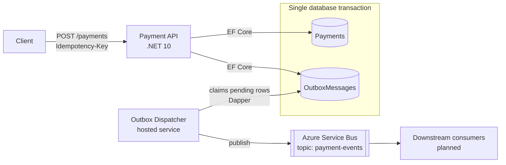

# PayFlow

[](https://github.com/arnoldojqf/payflow/actions/workflows/ci.yml)

**A cloud-native, event-driven payment gateway on Microsoft Azure, built with .NET 10 and an agentic engineering workflow.**

PayFlow is an open-source portfolio project where I apply the patterns that payment systems depend on in production: exactly-once *effects* over at-least-once delivery, idempotent APIs, and reliable messaging between services. It simulates payment processing end to end; no real money moves. It is also my hands-on lab for building software with AI agents (Claude Code) under real engineering discipline.

> **Status:** active development. See [Roadmap](#roadmap) for what is done and what is in progress.

---

## Architecture



**Write path.** `POST /payments` requires an `Idempotency-Key` header (a GUID). The API stores the payment and its `PaymentCreated` event in the **same PostgreSQL transaction** (transactional outbox) and answers `202 Accepted`. Either both rows are committed or neither is, so there is never a payment without its event, or an event without its payment. A retry with the same key replays the original response instead of creating a second payment.

**Publish path.** A background dispatcher, hosted inside the Payment API, polls for pending outbox rows and claims a batch with `FOR UPDATE SKIP LOCKED`, so several replicas can run without publishing the same row twice. It publishes each message to **Azure Service Bus** using the `Azure.Messaging.ServiceBus` SDK, then stamps the rows as processed in the transaction that claimed them. Delivery is at-least-once, so consumers are expected to be idempotent; every message carries the outbox row id as its `MessageId`. The reasoning is in [ADR 0001](docs/adr/0001-outbox-dispatch.md).

**Data access.** Writes go through **EF Core**. The dispatcher's claim query and its set-based updates go through **Dapper** with hand-written SQL, kept separate from the EF Core write model (CQRS-style). There is no query endpoint yet.

---

## Key design decisions

| Decision | Why | Trade-off accepted |
|---|---|---|
| **Transactional outbox** instead of writing to the DB and the broker separately | Avoids the dual-write problem: a crash between the two writes can't lose or invent an event | Extra table plus a dispatcher; events are published with a small delay |
| **Idempotency enforced by a UNIQUE constraint** (insert first, catch the unique violation) | The database is the single source of truth; no race window between "check" and "insert", even under concurrent retries | Relies on the DB returning a specific error code and constraint name, which the code must map correctly |
| **Dispatcher claims rows with `FOR UPDATE SKIP LOCKED`** and publishes inside that transaction | Replicas take disjoint batches without a coordinator, and a crash simply leaves the rows pending | Row locks are held during the publish, so batches are kept small; duplicates are possible and consumers must be idempotent |
| **Azure Service Bus** (replaced an earlier Kafka setup) | Managed broker with dead-lettering, retries and sessions out of the box; matches an Azure-first target platform | Less suited to event replay and high-throughput streaming than Kafka |
| **PostgreSQL** | Open source, portable across clouds, runs identically in Docker locally and managed in the cloud | Less native Azure tooling than Azure SQL |
| **EF Core for writes, Dapper for reads** | Rich change tracking and transactions where consistency matters; explicit SQL where the change tracker adds nothing | Two data-access styles to maintain |
| **Feature folders (vertical slices)** | Each feature (endpoint, entity, persistence mapping) lives together, which keeps changes local and is easier for agents to work on safely | Some duplication between slices is accepted over premature abstraction |
| **Real Service Bus namespace** for the transport test | Topic routing, the message subject and the `MessageId` are broker behaviour, so that test publishes through the real SDK and reads the message back | Requires an Azure subscription and secret handling; the test is excluded from CI |
| **Integration tests against a real PostgreSQL** | Verifies the behaviour that matters (constraints, transactions, row locking) instead of mocks | Slower than unit tests; needs Docker |

---

## Agentic engineering workflow

PayFlow is developed with **Claude Code in VS Code, connected remotely to WSL2 (Ubuntu)**. The agents follow the same rules a human developer would:

- **`CLAUDE.md`** documents the architecture, key decisions, conventions and working style. Agents read it before every task.
- **One Git worktree per feature**, so agents work in isolation and never on `main`.
- **Manual approval mode**: every command and edit is reviewed before it runs.
- **Model per task**: a faster model for implementation, a stronger model for architecture decisions.
- **Every change goes through a pull request** and is reviewed in the VS Code diff view before a rebase-and-merge.
- **`main` is protected**: no direct pushes, no force pushes, linear history only.

The goal is speed *with* control: AI agents write a large share of the code, but nothing reaches `main` without a human review.

---

## Tech stack

| Area | Technologies |
|---|---|
| Runtime | C#, .NET 10, ASP.NET Core |
| Data | PostgreSQL, EF Core (writes), Dapper (reads) |
| Messaging | Azure Service Bus (`Azure.Messaging.ServiceBus`) |
| Testing | xUnit v3 integration tests against real PostgreSQL in Docker |
| CI/CD | GitHub Actions (build and tests on every pull request and push to `main`) |
| Local dev | WSL2 (Ubuntu), Docker Engine, Docker Compose, VS Code + WSL extension |
| AI tooling | Claude Code |
| Planned | Azure Key Vault + Managed Identity, AKS, Terraform, OpenTelemetry, Azure Monitor |

---

## Roadmap

- [x] Payment API with database-enforced idempotency
- [x] Transactional outbox (write path)
- [x] Integration tests against a real database
- [x] Outbox dispatcher as a hosted background service publishing to Azure Service Bus
- [x] CI pipeline with GitHub Actions (build, tests, required status check on `main`)
- [ ] Mutation testing
- [ ] Payment Processor and Webhook Dispatcher services (consumers of the published events)
- [ ] Secrets in Azure Key Vault via Managed Identity (replacing `dotnet user-secrets`)
- [ ] Observability with OpenTelemetry and Azure Monitor (Application Insights)
- [ ] Containerized deployment to Azure Kubernetes Service (AKS)
- [ ] Infrastructure as Code with Terraform

---

## Getting started

**Prerequisites:** .NET 10 SDK and Docker. For the publish path you also need an Azure Service Bus namespace (Standard tier or above, since the project uses topics) with a topic named `payment-events` and a subscription on it named `payment-processor`.

```bash
# 1. Clone
git clone https://github.com/arnoldojqf/payflow.git
cd payflow

# 2. Start PostgreSQL (localhost:5432)
docker compose up -d

# 3. Set the Service Bus connection string locally (never committed)
dotnet user-secrets set "ServiceBus:ConnectionString" "<your-connection-string>" --project src/PayFlow.PaymentApi

# 4. Run the tests (this also applies the EF Core migrations)
dotnet test

# 5. Run the API (http://localhost:5051)
dotnet run --project src/PayFlow.PaymentApi
```

No Azure subscription? Skip step 3 and leave out the one test that talks to Service Bus, which is what CI does:

```bash
dotnet test --filter-not-trait "Category=ServiceBus"
```

The API does not apply migrations on startup. On a fresh database, run the tests once before starting it.

---

## Project structure

```
.
├── CLAUDE.md
├── PayFlow.slnx
├── README.md
├── docker-compose.yml
├── docs
│   └── adr
│       └── 0001-outbox-dispatch.md
├── dotnet-tools.json
├── global.json
├── src
│   ├── PayFlow.Contracts
│   │   ├── PayFlow.Contracts.csproj
│   │   └── Payments
│   └── PayFlow.PaymentApi
│       ├── Outbox
│       ├── PayFlow.PaymentApi.csproj
│       ├── PayFlow.PaymentApi.http
│       ├── Payments
│       ├── Persistence
│       ├── Program.cs
│       ├── Properties
│       ├── appsettings.Development.json
│       └── appsettings.json
└── tests
    └── PayFlow.PaymentApi.IntegrationTests
        ├── CreatePaymentIdempotencyTests.cs
        ├── CreatePaymentOutboxTests.cs
        ├── DatabaseCollection.cs
        ├── OutboxDispatcherTests.cs
        ├── PayFlow.PaymentApi.IntegrationTests.csproj
        ├── PaymentApiFactory.cs
        ├── RecordingOutboxPublisher.cs
        └── ServiceBusOutboxPublisherTests.cs
```

---

## Author

**Arnoldo Queiroz**, Senior Software Engineer · Cloud-Native .NET & Agentic Engineering Specialist

[LinkedIn]([YOUR_LINKEDIN_URL]) · arnoldojqf@gmail.com
